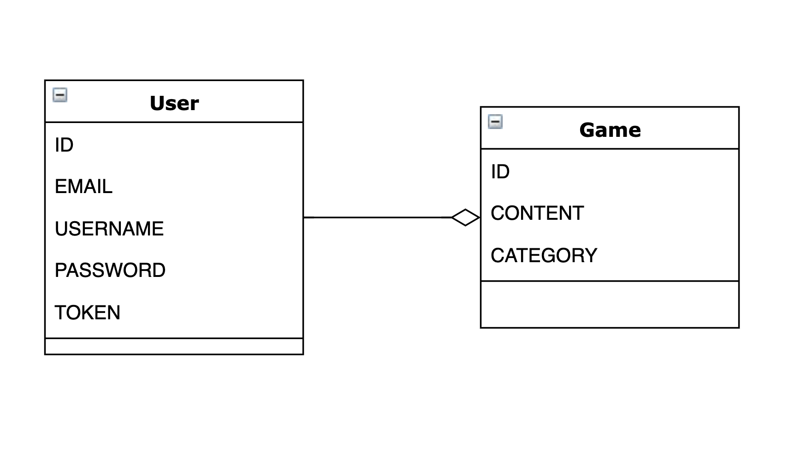

# Const Gamer: A Place to Play Games

Const Gamer is a web application created for hosting multiple types of games. The client side of the application was built using [React.js](https://reactjs.org)
and the back-end was built using [Ruby on Rails](https://rubyonrails.org)
.

### Game Board View


### Game List View


## Important Links

[Const Gamer Client Repo](https://github.com/GMorse19/project4-client)

[Const Gamer Deployed API](https://gentle-beach-45706.herokuapp.com/)

[Const Gamer Deployed Client](https://gmorse19.github.io/project4-client/)

## Planning

I began this API with just one resource other than user. I wanted to make sure I had things up and running before expanding with multiple resources. I plan to add a number of new resources over time with each game that I add to the [Const Gamer](https://gmorse19.github.io/project4-client/) app.

One goal of mine for this API was to create a username column for the user resource. I was able to successfully complete that.

## Unsolved Problems

As of now, everything seems to be working as planned. I would like to explore more complicated relationships between future resources.

## User Stories

#### Version 1
- As a user I would like to sign-up and sign-in - as a registered user with a username
- As a user I would like to choose a game to play
- As a user I would like to choose a challenge for the previously selected game
- As a user I would like to create a challenge for others to play
- As a user I would like the ability to delete a challenge that I’ve created
- As a user I would like the ability to update a challenge that I’ve created
- As a user I would like to view all challenges that others have created as well as my own
- As a user I would like the ability to change my password
- As a user I would like to sign-out

#### Version 2

- As a user I would like to count wins and losses
- As a user I would like to rate a game and/or a challenge
- As a user I would like to create a group of challenges to played against a timer
- As a user I would like to select a random puzzle
- As a user I would like to search by category

#### Version 1 ERD



## Catalog of Routes

| Verb  | URI Pattern     |
|-------|-----------------|
| GET   | /games          |
| GET   | /auth-games     |
| SHOW  | /games/:id      |
| SHOW  | /auth-games/:id |
| POST  | /create-game    |
| PATCH | /games/:id/edit |


## Installation

1. Fork and Clone this repository.
1.  Install dependencies with `bundle install`.
1.  Generate new `development` and `test` secrets (`bundle exec rails secret`).
1.  Store them in `.env` with keys `SECRET_KEY_BASE_<DEVELOPMENT|TEST>`
    respectively.
1.  In order to make requests to your deployed API, you will need to set
    `SECRET_KEY_BASE` in the environment of the production API (for example, using `heroku config:set` or the Heroku dashboard).
1.  In order to make requests from your deployed client application, you will
    need to set `CLIENT_ORIGIN` in the environment of the production API (for example, `heroku config:set CLIENT_ORIGIN=https://<github-username>.github.io`).

### Setup your database:
    - bin/rails db:drop (if it already exists)
    - bin/rails db:create
    - bin/rails db:migrate
    - bin/rails db:seed
    - bin/rails db:examples

  **Note**: Do this for each database you want to set up. Your local database and production (Heroku) database will both need to be set up in this way!


### Run your server
1. Run the API server with `bin/rails server` or `bundle exec rails server`.


## Tasks

Developers should run these often!

-   `bin/rails routes` lists the endpoints available in your API.
-   `bin/rspec spec` runs automated tests located in the `spec` folder.
-   `bin/rails console` opens a REPL that pre-loads the API.
-   `bin/rails db` opens your database client and loads the correct database.
-   `bin/rails server` starts the API.
-   `curl-scripts/*.sh` run various `curl` commands to test the API. See below.

## API

Use this as the basis for your own API documentation. Add a new third-level
heading for your custom entities, and follow the pattern provided for the
built-in user authentication documentation.

Scripts are included in [`curl-scripts`](curl-scripts) to test built-in actions. Add your
own scripts to test your custom API. As an alternative, you can write automated
tests in RSpec to test your API.

### Authentication Endpoints and Curl Scripts

| Verb   | URI Pattern            | Controller#Action |
|--------|------------------------|-------------------|
| POST   | `/sign-up`             | `users#signup`    |
| POST   | `/sign-in`             | `users#signin`    |
| PATCH  | `/change-password`     | `users#changepw`  |
| DELETE | `/sign-out`        | `users#signout`   |

#### POST /sign-up

Request:

```sh
curl http://localhost:4741/sign-up \
  --include \
  --request POST \
  --header "Content-Type: application/json" \
  --data '{
    "credentials": {
      "email": "'"${EMAIL}"'",
      "password": "'"${PASSWORD}"'",
      "password_confirmation": "'"${PASSWORD}"'"
    }
  }'
```

```sh
EMAIL=ava@bob.com PASSWORD=hannah curl-scripts/auth/sign-up.sh
```

Response:

```md
HTTP/1.1 201 Created
Content-Type: application/json; charset=utf-8

{
  "user": {
    "id": 1,
    "email": "ava@bob.com"
  }
}
```

#### POST /sign-in

Request:

```sh
curl http://localhost:4741/sign-in \
  --include \
  --request POST \
  --header "Content-Type: application/json" \
  --data '{
    "credentials": {
      "email": "'"${EMAIL}"'",
      "password": "'"${PASSWORD}"'"
    }
  }'
```

```sh
EMAIL=ava@bob.com PASSWORD=hannah curl-scripts/auth/sign-in.sh
```

Response:

```md
HTTP/1.1 200 OK
Content-Type: application/json; charset=utf-8

{
  "user": {
    "id": 1,
    "email": "ava@bob.com",
    "token": "BAhJIiVlZDIwZTMzMzQzODg5NTBmYjZlNjRlZDZlNzYxYzU2ZAY6BkVG--7e7f77f974edcf5e4887b56918f34cd9fe293b9f"
  }
}
```

#### PATCH /change-password

Request:

```sh
curl --include --request PATCH "http://localhost:4741/change-password" \
  --header "Authorization: Token token=$TOKEN" \
  --header "Content-Type: application/json" \
  --data '{
    "passwords": {
      "old": "'"${OLDPW}"'",
      "new": "'"${NEWPW}"'"
    }
  }'
```

```sh
OLDPW='hannah' NEWPW='elle' TOKEN='BAhJIiVlZDIwZTMzMzQzODg5NTBmYjZlNjRlZDZlNzYxYzU2ZAY6BkVG--7e7f77f974edcf5e4887b56918f34cd9fe293b9f' sh curl-scripts/auth/change-password.sh
```

Response:

```md
HTTP/1.1 204 No Content
```

#### DELETE /sign-out

Request:

```sh
curl http://localhost:4741/sign-out \
  --include \
  --request DELETE \
  --header "Authorization: Token token=$TOKEN"
```

```sh
TOKEN='BAhJIiVlZDIwZTMzMzQzODg5NTBmYjZlNjRlZDZlNzYxYzU2ZAY6BkVG--7e7f77f974edcf5e4887b56918f34cd9fe293b9f' sh curl-scripts/auth/sign-out.sh
```

Response:

```md
HTTP/1.1 204 No Content
```

### Keeping your database up to date

Remember, creating and applying [migrations](https://edgeguides.rubyonrails.org/active_record_migrations.html#creating-a-migration) are two different things. After you create a migration (one of those files that lives in `db/migrate/`), you need to apply it to each database using `bin/rails db:migrate` (local) or `heroku run rails db:migrate` (production).

### Rolling Back a Database Migration

Sometimes you need to revert a migration that you already applied. There are many ways to revert your database to a previous state, and one of the most common is simply rolling back (reverting) the last migration that you ran. Read more in the [Rails Guide](https://edgeguides.rubyonrails.org/active_record_migrations.html#rolling-back)

### Reset Database without dropping

If you don't want to completely [reset the database](https://edgeguides.rubyonrails.org/active_record_migrations.html#resetting-the-database) (maybe you have data you want to preserve?), you have other, less destructive options. One is rolling back a specific migration by specifying the `VERSION` that the database should revert to. Ask a consultant if you need assistance, as **database commands like these are non-reversable.**

To rerun _all_ migrations, starting from `VERSION=0`, you would do:


```sh
bin/rails db:migrate VERSION=0
bin/rails db:migrate db:seed db:examples
```

To run this command (and others like this) on Heroku, just append `heroku run` before the `rails` command.


## Additional Resources
- [Rails Guides: API-only app](http://guides.rubyonrails.org/api_app.html)
- [Building a JSON API with Rails 5](https://blog.codeship.com/building-a-json-api-with-rails-5/)

## [License](LICENSE)

1.  All content is licensed under a CC­BY­NC­SA 4.0 license.
1.  All software code is licensed under GNU GPLv3. For commercial use or
    alternative licensing, please contact legal@ga.co.
